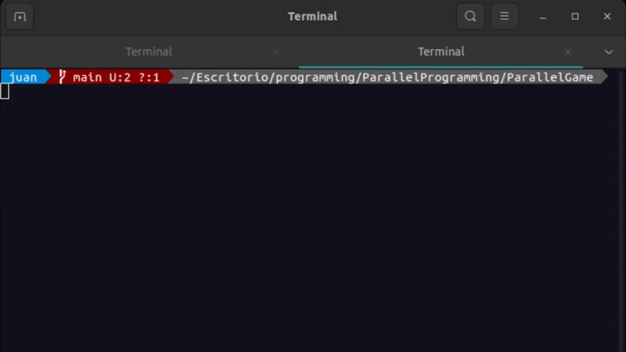

# Game that use threads

- `Student:` Mondalgo Tapia, Juan Carlos.
- `Course:` Parallel programming.
- `University:` UNMSM.

## Introduction
This game is a simple console-based game where a cat is trying to catch a mouse on a two-dimensional board. The game uses threads to simulate the concurrent movement of the cat and the mouse. The game board has a size of 100x100, and the cat and mouse are represented by the `Animal` struct.

## Requirements
- C++ compiler
- conio.h library

## How to run
- Clone the repository
- Compile the program
	``` bash
	g++ Mouse_Cat.cpp -o Mouse_Cat
	```

- Run the program
  ```bash
	./Mouse_Cat
	```

## How to play
- Use the letters `w`, `a`, `s`, `d` to move the coordinates of the cat.



## Explanation of the code

### 1. Header and Libraries:
```cpp
#include <thread>
#include <iostream>
#include <conio.h>
#include <cmath>
#include <string>
#include <atomic>

#ifdef _WIN32
#include <conio.h>
#include <windows.h>
#define CLEAR_SCREEN() std::system("cls")
#else
#include <cstdlib>
#define CLEAR_SCREEN() std::system("clear")
#endif
```
This section includes necessary C++ headers and libraries for multi-threading (`<thread>`), input/output (`<iostream>`), console input (`<conio.h>`), mathematical functions (`<cmath>`), string manipulation (`<string>`), and atomic operations (`<atomic>`). It also contains platform-specific code for clearing the screen based on the operating system.

### 2. Constants:
```cpp
const int BOARD_SIZE = 100;
const double DISTANCE_THRESHOLD = 2.0;
```
These constants define the size of the board and the distance threshold at which the cat catches the mouse.

### 3. Atomic Flag
```cpp
std::atomic<bool> finished(false);
```
This atomic flag (`finished`) is used to signal the threads to stop when the simulation is over.

### 4. Animal Structure

```cpp
struct Animal
{
  int x, y;
  int direction;
};
```
This structure represents an animal's position (`x`, `y`) on the board and its movement direction (`direction`).

### 5. Distance Calculation Function
```cpp
double distance(int x1, int y1, int x2, int y2)
{
  return std::sqrt(std::pow(x1 - x2, 2) + std::pow(y1 - y2, 2));
}
```

This function calculates the Euclidean distance between two points (`x1`, `y1`) and (`x2`, `y2`).

### 6. Utility Function for Formatting Digits
```cpp
std::string twoDigits(int n)
{
  if (n < 10)
  {
    return "0" + std::to_string(n);
  }
  else
  {
    return std::to_string(n);
  }
}
```
This function formats a number as a two-digit string.

### 7. Cat Thread Function

```cpp
void catThreadFunction(Animal& cat) {
  while (!finished) {
    // Display cat's position
    gotoxy(10, 10);
    std::cout << "Gato: " << twoDigits(cat.x) << ", " << twoDigits(cat.y) << std::endl;

    // Get user input for cat movement
    char c = getch();
    if (c == 'a') {
      if(cat.x > 0)
        cat.x -= 1;
    } else if (c == 'd') {
      if(cat.x < 99)
        cat.x += 1;
    } else if (c == 'w') {
      if(cat.y < 99)
        cat.y += 1;
    } else if (c == 's') {
      if(cat.y > 0)
        cat.y -= 1;
    }
  }
}
```

This function represents the behavior of the cat thread. It continuously displays the cat's position and updates its position based on user input.

### 8. Mouse Thread Function

```cpp
void mouseThreadFunction(Animal& mouse, const Animal& cat) {
  while (!finished) {
    // Update mouse's position
    mouse.x += mouse.direction;
    if (mouse.x <= 0 || mouse.x > BOARD_SIZE) {
      mouse.direction *= -1;
    }

    // Check if cat caught the mouse
    if (distance(cat.x, cat.y, mouse.x, mouse.y) < DISTANCE_THRESHOLD) {
        gotoxy(10, 15);
        std::cout << "¡El gato ha atrapado al ratón!" << std::endl;
        finished = true;
        break;
    }

    // Display mouse's position
    gotoxy(10, 5);
    std::cout << "Ratón: " << twoDigits(mouse.x) << ", " << twoDigits(mouse.y) << std::endl;

    // Pause for a short duration
    std::this_thread::sleep_for(std::chrono::milliseconds(300));
  }
}
```

This function represents the behavior of the mouse thread. It continuously updates the mouse's position and checks if the cat caught the mouse based on the distance threshold. If caught, it displays a message, sets the `finished` flag, and breaks out of the loop.

### 9. Main Function

```cpp
int main()
{
  CLEAR_SCREEN();
  Animal cat = {1, 1, 1};
  Animal mouse = {50, 50, -1};

  // Create threads for cat and mouse
  std::thread catThread(catThreadFunction, std::ref(cat));
  std::thread mouseThread(mouseThreadFunction, std::ref(mouse), std::ref(cat));

  // Wait for threads to finish
  catThread.join();
  mouseThread.join();

  return 0;
}
```

In the `main` function, the screen is cleared, and initial positions for the cat and mouse are set. Threads for the cat and mouse behaviors are created, and the program waits for both threads to finish using `join`.